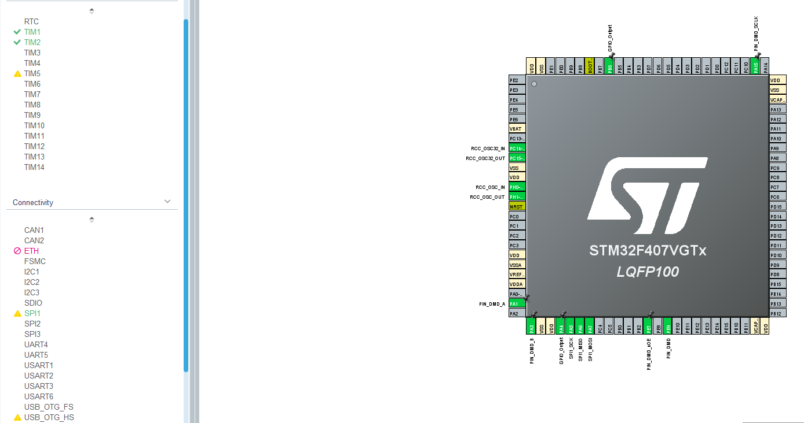
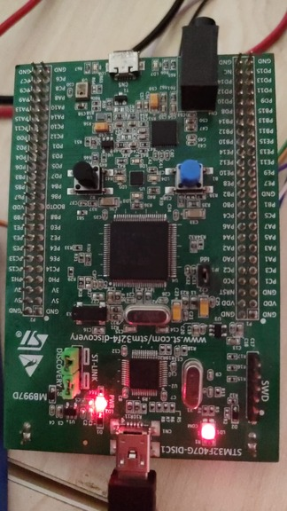
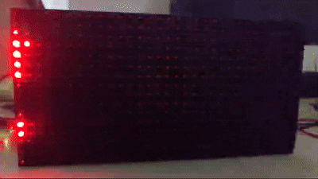

# DMD P10 Panel Library with STM32 HAL Libraries

This library contains P10 led panel drive library.

**NOTE:** This library is tested at **STM32F407VTG6** Discovery Board.

# Contents
- [Package Description](#package-description)
- [Configuration](#configuration)
- [Output](#output)
- [Contact Me]()
- [Donate](#donation)

# Package Description
 Copyright (C) 2025 Osman Taşbaşı (osman.tasbasi@inorobotics.com)

 Note that the DMD library uses the SPI port for the fastest, low overhead writing to the
 display. Keep an eye on conflicts if there are any other devices running from the same
 SPI port, and that the chip select on those devices is correctly set to be inactive
 when the DMD is being written to.

 **LED Panel Layout in RAM**
>
                            32 pixels (4 bytes)
        top left  ----------------------------------------
                  |                                      |
         Screen 1 |        512 pixels (64 bytes)         | 16 pixels
                  |                                      |
                  ---------------------------------------- bottom right

 ---
 **NOTE**: This software is written for P10 DMD Led Panel drive with STM32 using STM HAL Libraries.
 
 This program is free software: you can redistribute it and/or modify it under the terms
 of the version 3 GNU General Public License as published by the Free Software Foundation.

 This program is distributed in the hope that it will be useful, but WITHOUT ANY WARRANTY;
 without even the implied warranty of MERCHANTABILITY or FITNESS FOR A PARTICULAR PURPOSE.
 See the GNU General Public License for more details.

 You should have received a copy of the GNU General Public License along with this program.
 If not, see <http://www.gnu.org/licenses/>.

 # Configuration 
 This part is contains which parameters must be configured for using this library

- **PIN_DMD_nOE**:
   - **Desc**: Setting this low lights all the LEDs in the selected rows. Can pwm it at very high frequency for brightness control.
   - **Conf**: Analog output. Set pwm frequency to 490Hz.
- **OE_TIM**:
   - **Desc**: Which TIM is using for pwm output
   - **Conf**: Default TIM1
- **OE_HTIM**:
   - **Desc**: Which TIM pointer is using
   - **Conf**: Default htim1
- **OE_TIM_CHANNEL**:
   - **Desc**: Which channel is using at TIM for pwm output.
   - **Conf**: Default TIM_CHANNEL_1

- **PIN_DMD_A**:
   - **Conf**: GPIO_OUPUT
- **PIN_DMD_B**:
   - **Conf**: GPIO_OUPUT
- **PIN_DMD_SCLK**:
   - **Conf**: GPIO_OUPUT

- **PANEL_SPI**:
   - **Desc**: Which spi is using for communication for data transferring
   - **Conf**: Default SPI1:

         - Mode: Master
         - Direction: Full Duplex or Half Duplex
         - DataSize: 8
         - CLKPolarity: LOW
         - CLKPhase: EDGE
         - NSS: SOFTWARE
         - BaudRatePrescaler: 256 (If it is not in your cubemx selecet the highest value and test it)
         - FirstBit: MSB
         - CRCCalculation: DISABLE

## STM32CubeMX Configuration
**STM32CubeMX** is a graphical tool that allows a very easy configuration of STM32 microcontrollers and microprocessors.

# Output

**STM32F407VGT6 Discovery**

**P10 Led Panel Animation**

# 📬 Contact Me
Feel free to reach out to me via the following platforms:

# Donation
It took me a lot of time to search and write this library. If my work helps you, you can donate it in the below.

**BEP20 Binance USDT Network**

